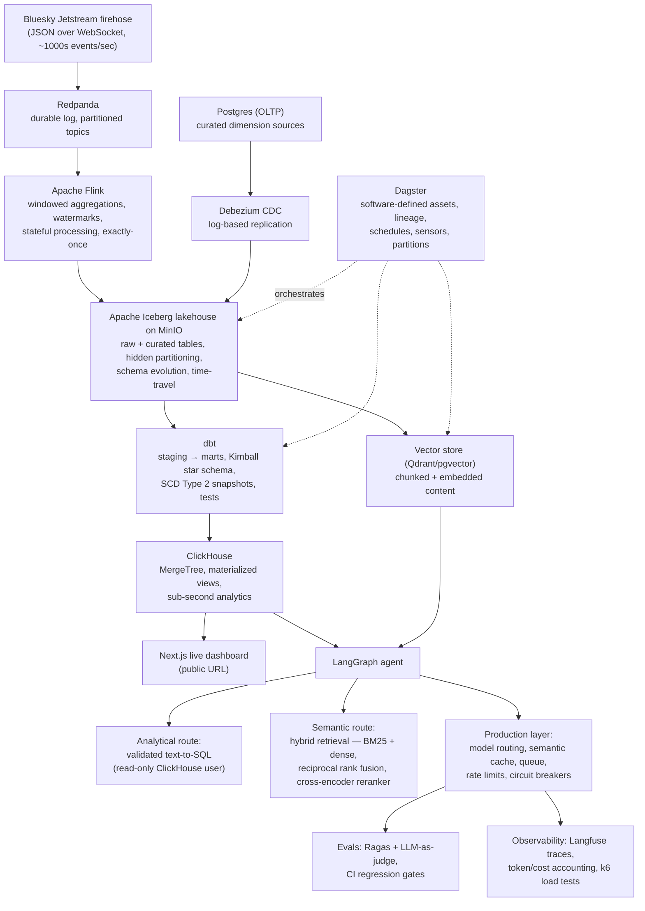
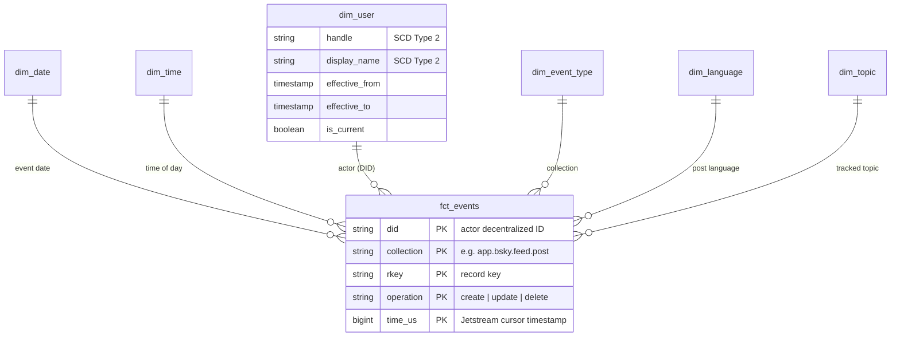

# Real-Time Lakehouse + AI Platform

**A production-style, end-to-end data platform built solo:** a live social-media firehose
(thousands of events/sec) streamed through a Kafka-compatible log and Apache Flink into an
Apache Iceberg lakehouse, modeled into a Kimball star schema with dbt, served sub-second
from ClickHouse behind a live dashboard — with an AI agent (text-to-SQL + hybrid RAG) and a
full production layer (evals in CI, tracing, load tests, failure postmortems) on top.

One integrated system deliberately covering three pillars: **Data Engineering**,
**AI Engineering**, and **System Design**.

> 🚧 **Status: in active development** (July → October 2026, ~12–16 weeks part-time).
> Built design-doc-first, executed in phases — each phase independently runnable and
> demoable. The full build plan is public: [docs/build_plan.md](docs/build_plan.md).
> Locked design decisions with reasoning: [docs/design_decisions.md](docs/design_decisions.md).

## Project status

| Phase | Scope | Status |
|---|---|---|
| **Phase 0** | Design doc, star-schema design, repo + Compose skeleton, working agreements | ✅ **Complete** |
| **Phase 1** | Streaming ingestion (Redpanda), Flink (watermarks, exactly-once), Iceberg on MinIO, Debezium CDC, dbt star schema + SCD2, Dagster orchestration, quality gates | 🔜 Up next |
| **Phase 2** | ClickHouse serving layer (materialized views, p95 < 200 ms target), public live Next.js dashboard | ⬜ Planned |
| **Phase 3** | LangGraph agent: validated text-to-SQL over ClickHouse + hybrid RAG (BM25 + dense + reranker), MCP tools, experimentation module (variant assignment, significance testing) | ⬜ Planned |
| **Phase 4** | Production layer: model routing, semantic cache, queue-backed workers, rate limiting, circuit breakers, Ragas + LLM-judge evals gating CI, Langfuse cost tracing, k6 load tests, induced-failure postmortems | ⬜ Planned |

## Why this project

Most portfolio projects demonstrate one tool in isolation. Real platforms are the opposite:
the hard problems live **between** components — backpressure, exactly-once delivery across
system boundaries, cache invalidation, late-arriving data, graceful degradation, cost per
query. This project is one coherent system where those problems actually occur and get
solved deliberately:

- **Correct streaming semantics**, not just "data moves": event time vs processing time,
  watermarks and late-data handling, checkpoint recovery verified by killing processes
  mid-stream.
- **Dimensional modeling done properly**: an explicit fact-table grain statement,
  conformed dimensions, SCD Type 2 with point-in-time-correct joins.
- **AI grounded in the platform's own live data** — not a chatbot wrapper: validated
  text-to-SQL against the serving layer, hybrid retrieval with reranking, and an
  evaluation harness that blocks CI on quality regressions.
- **Production discipline**: load tested to a documented p99, capacity-planning math,
  circuit breakers proven by inducing real failures, written postmortems.

## Architecture



Everything runs locally in **Docker Compose** on a laptop for ~$0 — Redpanda, Flink,
MinIO, Postgres, Debezium, ClickHouse, Qdrant, Dagster, Langfuse. No Kubernetes by
design (single-node; Compose is the honest tool). Public deployment arrives with the
dashboard phase.

## The data model (designed before any code)

The star schema was designed on paper in Phase 0 and locked in
[docs/design_decisions.md](docs/design_decisions.md) — because retrofitting a fact
grain is the most expensive mistake in analytics engineering.

**Fact table — `fct_events`, with an explicit grain statement:**

> One row per Jetstream **commit event** — a create, update, or delete of a record
> (post, like, repost, follow, block, …) — uniquely identified by
> **`(did, collection, rkey, operation, time_us)`**.

Key properties of this grain:

- **Atomic**: the finest grain available. Every rollup (per-minute trends, per-entity
  activity) is *derived* downstream in dbt/ClickHouse — aggregates are never the source
  of truth.
- **Idempotent ingestion**: Jetstream replays events from a cursor on reconnect; the
  composite key de-duplicates replays deterministically.
- **Scoped**: identity/account messages are *not* fact rows — they feed dimensions.
  A different grain would mean a different fact table, not sparse columns in this one.

**Dimensions:**



| Dimension | Source | Notes |
|---|---|---|
| `dim_date` / `dim_time` | Generated | Standard calendar & time-of-day attributes |
| `dim_user` | Jetstream identity events + Postgres via Debezium | **SCD Type 2** — handles/display names change organically in the live stream; joins are point-in-time correct (`event_time BETWEEN effective_from AND effective_to`) |
| `dim_event_type` | Postgres via Debezium | Maps collection strings to friendly names/categories |
| `dim_language` | Post `langs` field | Powers language-breakdown analytics |
| `dim_topic` | Curated Postgres table via Debezium | Hand-maintained tracked topics; exercises CDC end-to-end |

## Tech choices — and why

| Layer | Choice | Why (vs. the alternative) |
|---|---|---|
| Durable log | **Redpanda** | Kafka-API-compatible in a single binary — full Kafka semantics (partitions, consumer groups, offsets) without ZooKeeper/KRaft cluster overhead on a laptop |
| Stream processing | **Apache Flink** | True event-time processing, watermarks, and exactly-once via checkpointing + two-phase-commit sinks — semantics Spark micro-batching approximates |
| Lakehouse format | **Apache Iceberg** | ACID on object storage, hidden partitioning, schema evolution, and snapshot time-travel — capabilities raw Parquet simply lacks |
| Object store | **MinIO** | S3-compatible locally; the Iceberg layer is portable to real S3 unchanged |
| CDC | **Debezium** | Log-based replication from Postgres (reads the WAL) — no polling load, no missed intermediate states |
| Transformation | **dbt** | Versioned, tested SQL with staging → marts layering; snapshots implement SCD2 declaratively |
| Warehouse modeling | **Kimball star schema** | Explicit grain + conformed dimensions: the vocabulary of every analytics org and DE interview |
| Orchestration | **Dagster** | Software-defined assets with lineage as a first-class concept — the DAG mirrors the data model, not ad-hoc task graphs |
| Serving | **ClickHouse** | Columnar MergeTree + incremental materialized views: sub-second aggregations over continuously ingested data |
| Dashboard | **Next.js/React** | Live-updating public artifact; the demo a stranger can open |
| Agent | **LangGraph** | Explicit state-machine control over agent loops — routing, retries, termination guards — instead of implicit chains |
| Agent safety | Read-only ClickHouse user + SQL validation | Generated SQL is never trusted; the blast radius of a bad query is bounded by design |
| Retrieval | BM25 + dense + **reciprocal rank fusion** + cross-encoder reranker | Lexical and semantic retrieval fail differently; fusion + reranking beats either alone |
| Evals | **Ragas + LLM-as-judge, wired into CI** | Retrieval/generation quality regressions should block a merge like failing unit tests |
| Observability | **Langfuse** | Per-request traces, token counts, and cost accounting — "what does a query cost" answered with data |
| Load testing | **k6** | Find the p99 knee and document throughput at saturation, not vibes |
| Serialization | JSON (for now) | Deliberate simplicity first; the producer layer is where Avro/Protobuf + a schema registry would slot in, and the tradeoff is documented |

## Repository layout

```
├── ingestion/        # Firehose producer(s) — WebSocket → Redpanda (source-swappable)
├── streaming/        # Flink jobs: windowed aggregations, exactly-once sinks
├── transforms/       # dbt project: staging → marts, snapshots (SCD2), tests
├── orchestration/    # Dagster: software-defined assets, schedules, sensors
├── dashboard/        # Next.js live dashboard
├── agent/            # LangGraph agent + MCP tools
├── docs/             # Build plan, design decisions, quiz log, postmortems
├── docker-compose.yml
└── Makefile          # make up / down / logs / clean
```

## Running locally

Requires Docker. The entire stack is Docker Compose — nothing runs bare on the host.

```bash
make up      # start the stack
make logs    # follow logs
make down    # stop
make clean   # stop + remove volumes and local data
```

*(Phase 0: the Compose file is a validated skeleton with services introduced
phase-by-phase — see the status table above for what's live.)*

## Engineering discipline

This repo is run the way production teams run projects:

- **Design doc before code.** Every architecture decision is written down with its
  tradeoff reasoning in [docs/design_decisions.md](docs/design_decisions.md) before
  implementation starts. Decisions are locked once made.
- **Explicit fact grain.** "One row per what?" is answered precisely and documented —
  ambiguity here is the classic data-modeling failure.
- **Phased delivery.** Each phase leaves the system independently runnable and demoable;
  value is banked early rather than integrated at the end.
- **Failure is part of the plan.** Later phases deliberately induce outages (kill Flink
  mid-stream, take the vector store down, saturate the queue) and document recovery in
  written postmortems.
- **Quality gates in CI.** dbt tests + data-quality checks for the data layer; Ragas +
  LLM-judge regression gates for the AI layer.

## Planned artifacts

As phases complete, this section accumulates the evidence:

- [ ] Live public dashboard URL with real data flowing
- [ ] Dagster lineage graph screenshot
- [ ] Benchmark write-up: throughput, p50/p99 latency, cost per 1k queries
- [ ] Eval report: golden set, Ragas metrics, before/after reranker table
- [ ] Langfuse cost-dashboard screenshot
- [ ] Failure postmortems (induced outages, documented recovery)
- [x] Design doc with tradeoff reasoning — [docs/design_decisions.md](docs/design_decisions.md)
- [x] Full build plan — [docs/build_plan.md](docs/build_plan.md)

---

**Author:** Sakshyam Patro · Built in public — the commit history *is* the progress log.
